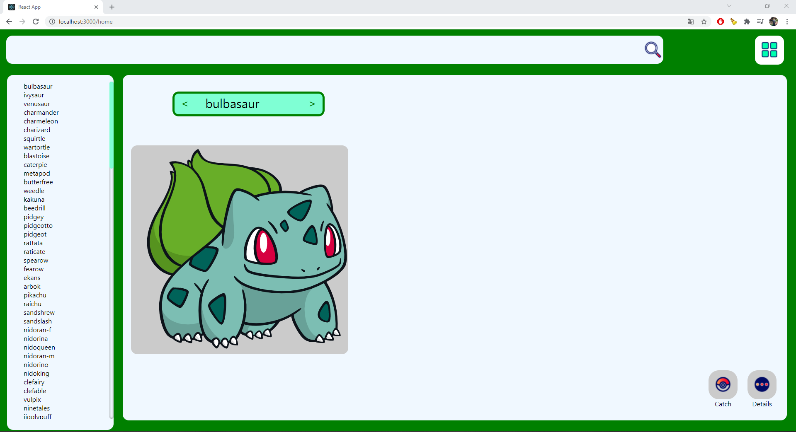
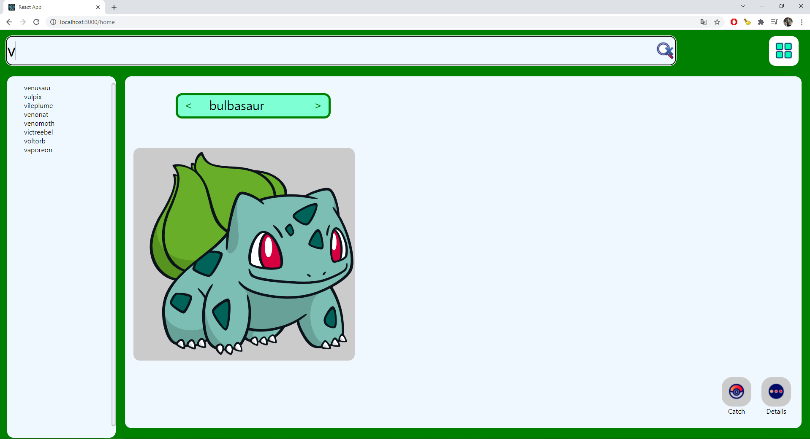
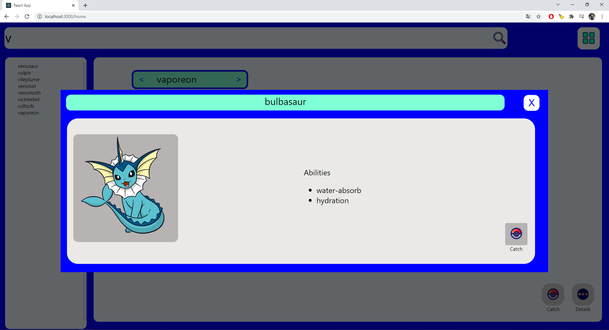
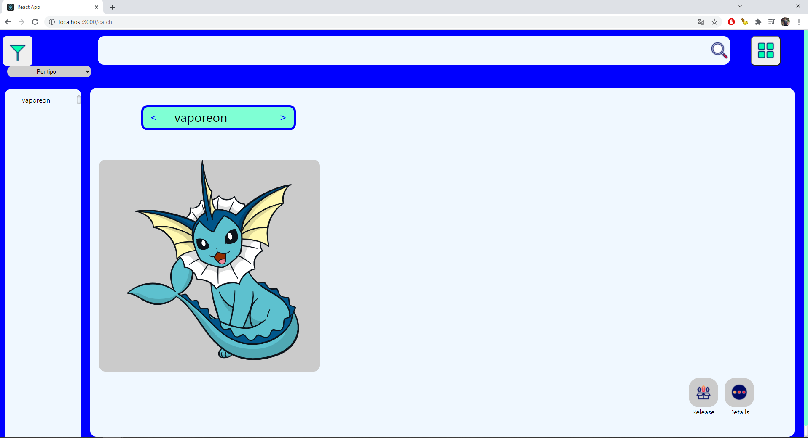
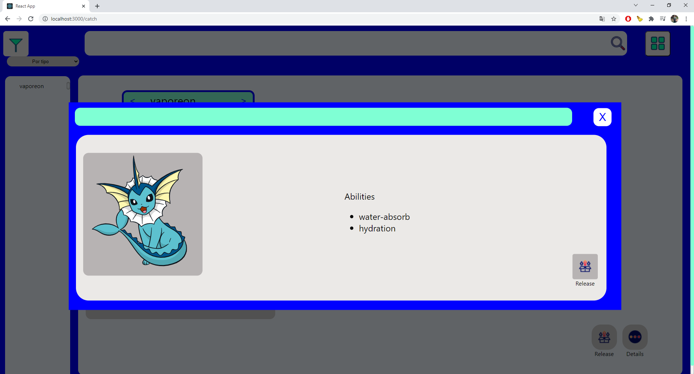

# Getting Started with Create React App

This project was bootstrapped with [Create React App](https://github.com/facebook/create-react-app).

## Available Scripts

In the project directory, you can run:

### `yarn start`

Runs the app in the development mode.\
Open [http://localhost:3000](http://localhost:3000) to view it in the browser.

The page will reload if you make edits.\
You will also see any lint errors in the console.

### `yarn test`

Launches the test runner in the interactive watch mode.\
See the section about [running tests](https://facebook.github.io/create-react-app/docs/running-tests) for more information.

## Images








## Project description
Proyecto final:

- Historial en git

- Rutas:
  - Lista de pokemones capturados
  - Buscador(Pokedex)

- Modal
  - Detalle de pokemon
    - Navegador para ir de un prokemón a otro sin necesidad de volver a vista anterior
      - Adelante y atrás (useCallback)	

- Hacer un **caché** para evitar rehacer la misma consulta al servidor
- Pokedex
  - Buscador
    - Se cargan inicalmente 150 pokemons y se muestran
      - <https://pokeapi.co/api/v2/pokemon/?offset=0&limit=150>
      - Mientras se carga la lista mostrar un spinner
    - Input y botón para realizar la búsqueda
      - Se realiza la busuqeda sobre los pokemones consultados incialmente 
    - Mostrar resultados del seleccionado:
      - Si hay resultados mostrar: 
        - nombre,
        - imagen, 
        - botón de captura, 
        - ver detalles (Link al detalle del pokemón)
        - Over style (borde, background color)
      - Si no hay resultados mostrar un texto que indique “no results found”
      - Si se limpia el input mostrar de nuevo todos

- Lista de pokemones capturados
  - **Usar context api para persisitir los pokemones capturados**
  
  - Mostrar los pokemones que capturé

  - Se puede ir al detalle de cada uno a la vista

  - El tipo de pokemón favorito determina un COLOR en la UI(borde, fondo)
    - Este tipo se calcular analizando los tipos principales en mi lista y el que tenga mayor resultados determina
    - Si hay varios con la misma cantidad se selecciona cualquier tipo
    - **Conditional styles**

  - Ordenar
    - Por nombre
    - Por tipo principal

  - Se puede liberar desde ambos
    - Vista de detalle
    - Lista de pokemon

- Unit testing (jest)

- Integration RTL


## Create Project

```sh
npx create-react-app my-app
```

## Install axios
```sh
npm i axios
```

## Install sass
```sh
npm install sass
```

## Install react router
```sh
npm i react-router
```
## Install lodash
```sh
npm i lodash
```